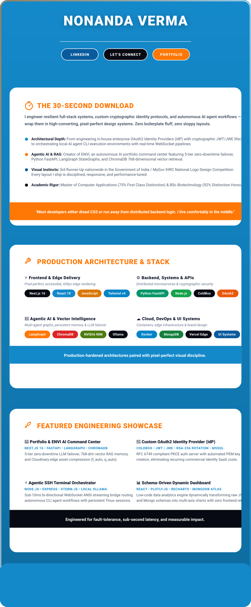

  

 

## ⏱️ The 30-Second Download

I engineer resilient full-stack systems, custom cryptographic identity protocols, and autonomous AI agent workflows — then wrap them in high-converting, pixel-perfect design systems. Zero boilerplate fluff, zero sloppy layouts.

- 🏗️ **Architectural Depth** — from engineering in-house enterprise OAuth2 Identity Providers (IdP) with cryptographic JWT/JWE lifecycles, to orchestrating local AI agent CLI execution environments with real-time WebSocket pipelines.
- 🤖 **Agentic AI & RAG** — creator of **ENVI**, an autonomous AI portfolio command center featuring 5-tier zero-downtime LLM failover, Python FastAPI, LangGraph StateGraphs, and ChromaDB 768-dimensional vector retrieval.
- 🎨 **Visual Instincts** — 3rd Runner-Up nationwide in the Government of India / MyGov IHRC National Logo Design Competition. Every layout I ship is disciplined, responsive, and performance-tuned.
- 🎓 **Academic Rigor** — Master of Computer Applications (75%, First Class Distinction) & BSc Biotechnology (92%, Distinction Honours).

> *"Most developers either dread CSS or run away from distributed backend logic. I live comfortably in the middle."*

 

## 🔧 Production Architecture & Stack

**⚡ Frontend & Edge Delivery** — pixel-perfect, accessible, 60fps edge rendering

**⚙️ Backend, Systems & APIs** — distributed microservices & cryptographic security

**🤖 Agentic AI & Vector Intelligence** — multi-agent graphs, persistent memory & LLM failover

**☁️ Cloud, DevOps & UI Systems** — containers, edge infrastructure & brand design

> Production-hardened architectures paired with pixel-perfect visual discipline.

 

## 🚀 Featured Engineering Showcase

#### 🚀 Portfolio & ENVI AI Command Center
`Next.js 16` `FastAPI` `LangGraph` `ChromaDB`
5-tier zero-downtime LLM failover, 768-dim vector RAG memory, and Cloudinary edge asset compression (`f_auto`, `q_auto`).

#### 🔐 Custom OAuth2 Identity Provider (IdP)
`ColdBox` `JWT / JWE` `RSA-256 Rotation` `MSSQL`
RFC 6749 compliant PKCE auth server with automated PEM key rotation, eliminating recurring commercial identity SaaS costs.

#### ⚡ Agentic SSH Terminal Orchestrator
`Node.js` `Express` `xterm.js` `Local Ollama`
Sub-10ms bi-directional WebSocket ANSI streaming bridge routing autonomous CLI agent workflows with persistent Tmux sessions.

#### 📊 Schema-Driven Dynamic Dashboard
`React` `Plotly.js` `Recharts` `MongoDB Atlas`
Low-code data analytics engine dynamically transforming raw JSON and Mongo schemas into multi-axis charts with zero frontend rebuilds.

> Engineered for fault-tolerance, sub-second latency, and measurable impact.

 

  

Crafted with intentional design aesthetics and resilient code by <b>Nonanda Verma</b>.

