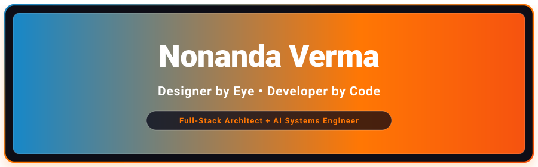
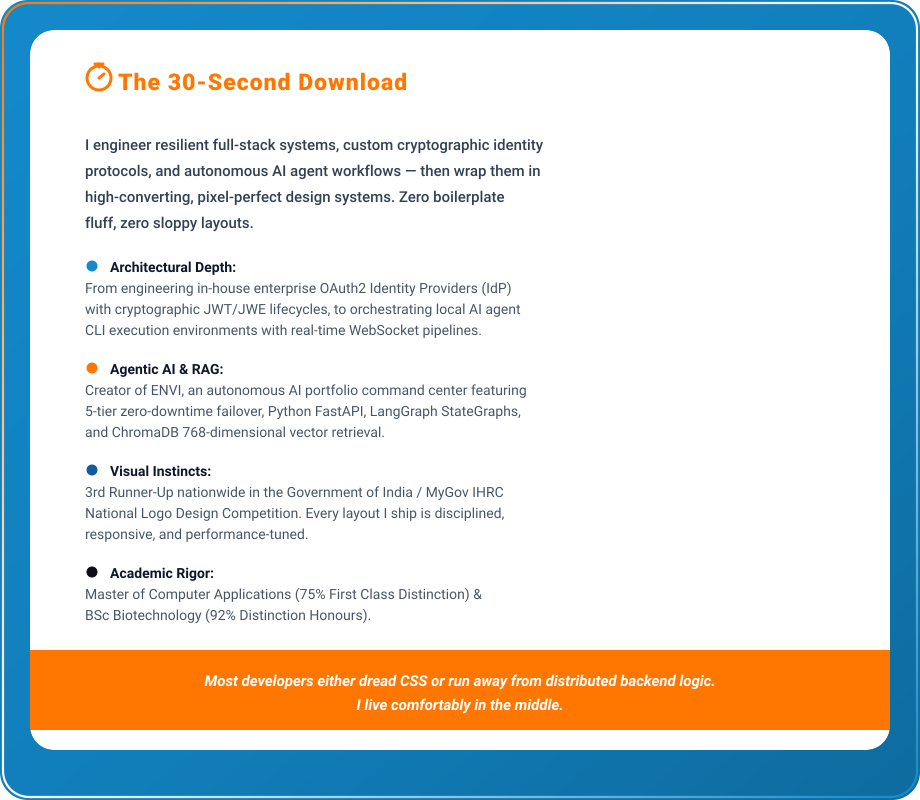
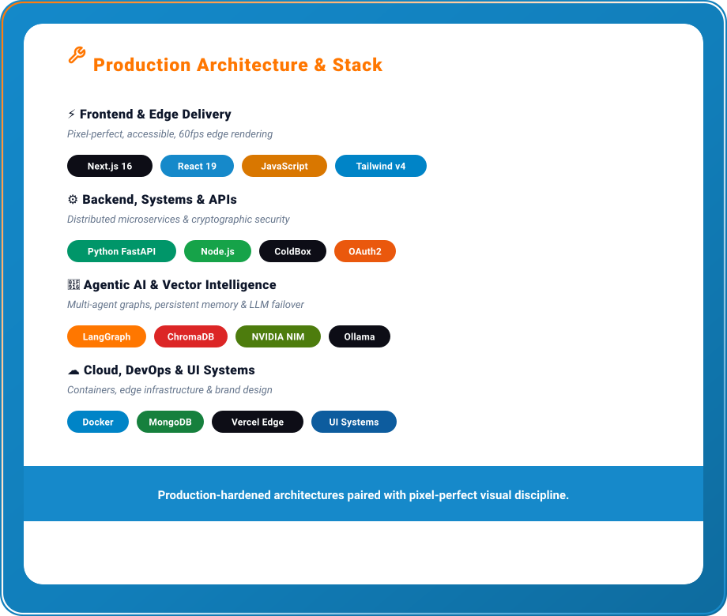
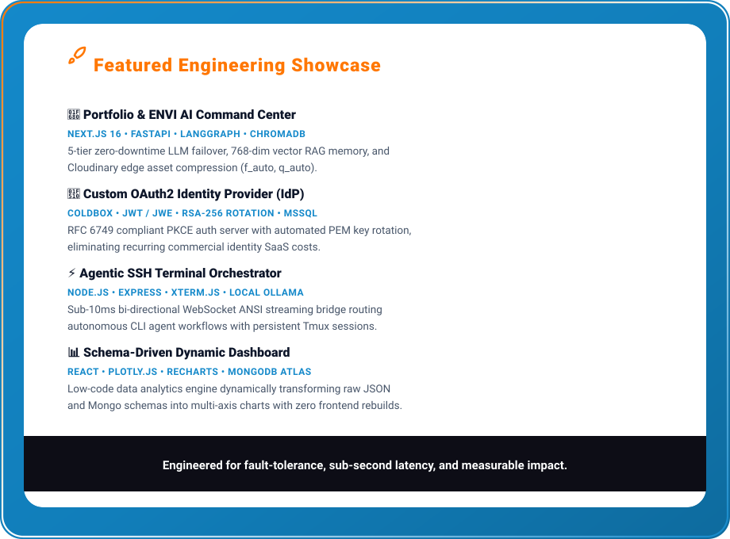

  <!-- Canva Top Header Banner -->
  

    

  <!-- Canva Pill Buttons -->
  

    
    &nbsp;&nbsp;&nbsp;
    
    &nbsp;&nbsp;&nbsp;
    
  

   

  <!-- Canva Card 1: The 30-Second Download -->
  

    

  <!-- Canva Card 2: Production Architecture & Stack -->
  

    

  <!-- Canva Card 3: Featured Engineering Showcase -->
  

    

  <!-- Clickable Live Action Links -->
  

    <a href="https://nonanda-verma-web-portfolio.vercel.app" target="_blank"><b>🌐 Launch Live Portfolio & ENVI AI ↗</b></a>
    &nbsp;&nbsp;&nbsp;•&nbsp;&nbsp;&nbsp;
    <a href="https://www.linkedin.com/in/nonanda-verma-a73468249/" target="_blank"><b>💼 Connect on LinkedIn ↗</b></a>
    &nbsp;&nbsp;&nbsp;•&nbsp;&nbsp;&nbsp;
    <a href="mailto:nonandaverma@gmail.com"><b>✉️ Direct Email ↗</b></a>
  

   

  <!-- GitHub Contribution Streak -->
  

    

  <!-- Canva Wave Ribbon Footer -->
  

  

    Crafted with intentional design aesthetics and resilient code by <b>Nonanda Verma</b>.
  

