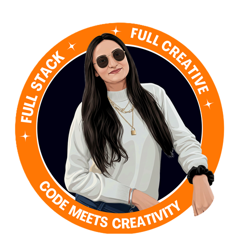

### 

 

## 🧠 The 30-Second Download

I engineer resilient full-stack systems, custom cryptographic identity protocols, and autonomous AI agent workflows — then wrap them in high-converting, pixel-perfect design systems. Zero boilerplate fluff, zero sloppy layouts.

- 🏗️ **Architectural Depth** — from engineering in-house enterprise OAuth2 Identity Providers (IdP) with cryptographic JWT/JWE lifecycles, to orchestrating local AI agent CLI execution environments with real-time WebSocket pipelines.
- 🤖 **Agentic AI & RAG** — creator of **ENVI**, an autonomous AI portfolio command center featuring 5-tier zero-downtime LLM failover, Python FastAPI, LangGraph StateGraphs, and ChromaDB 768-dimensional vector retrieval.
- 🎨 **Visual Instincts** — 3rd Runner-Up nationwide in the Government of India / MyGov IHRC National Logo Design Competition.
- 🎓 **Academic Rigor** — Master of Computer Applications (75%, First Class Distinction) & BSc Biotechnology (92%, Distinction Honours).

> *"Most developers either dread CSS or run away from distributed backend logic. I live comfortably in the middle."*

 

## 🛠️ Production Architecture & Stack

**Frontend & Edge**
 

**Backend & APIs**
 

**Agentic AI & Vector Intelligence**
 

**Cloud & DevOps**
 

 

## 🔗 Agentic AI Pipeline

**ChromaDB Vector Memory**  →  **LangGraph Agent Orchestration**  →  **5-Tier LLM Failover**  →  **Cryptographic Output (JWT / OAuth2)**

> Retrieval, reasoning, and failover — secured end-to-end.

 

## 🚀 Featured Engineering Showcase

<table>
<tr>
<td width="50%" valign="top">

**🚀 Portfolio & ENVI AI Command Center**
 `Next.js 16` `FastAPI` `LangGraph` `ChromaDB`

5-tier zero-downtime LLM failover, 768-dim vector RAG memory, and Cloudinary edge asset compression.

</td>
<td width="50%" valign="top">

**🔐 Custom OAuth2 Identity Provider**
 `ColdBox` `JWT/JWE` `RSA-256` `MSSQL`

RFC 6749 compliant PKCE auth server with automated PEM key rotation, eliminating commercial identity SaaS costs.

</td>
</tr>
<tr>
<td width="50%" valign="top">

**⚡ Agentic SSH Terminal Orchestrator**
 `Node.js` `Express` `xterm.js` `Ollama`

Sub-10ms bi-directional WebSocket ANSI streaming bridge routing autonomous CLI agent workflows with persistent Tmux sessions.

</td>
<td width="50%" valign="top">

**📊 Schema-Driven Dynamic Dashboard**
 `React` `Plotly.js` `Recharts` `MongoDB`

Low-code analytics engine dynamically transforming raw JSON/Mongo schemas into multi-axis charts with zero rebuilds.

</td>
</tr>
</table>

 

## 📊 GitHub Analytics

  

## 📬 Let's Connect

  

Crafted with intentional design aesthetics and resilient code by <b>Nonanda Verma</b>.

